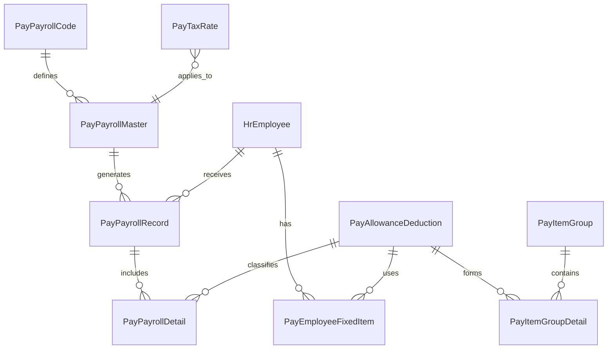

# 보상/급여(CPN) 모듈 개발 계획서

> 작성일: 2026-02-25
> 프로젝트: Vibe-HR (인사관리 시스템)
> 모듈명: CPN (Compensation - 보상/급여)

---

## 1. 개요

### 1.1 목적
TIM(근태) 모듈에 이어, 엔터프라이즈급(AutoEver 등 참고) 급여 시스템에 부합하는 **보상/급여(CPN)** 모듈을 개발한다.
결근/지각/초과근무 등 근태 데이터를 연동하여 최종 명세서 발급 및 은행 이체(펌뱅킹) 파일 생성까지 전체 라이프사이클을 커버한다.

### 1.2 개발 원칙
1. **단계적 개발 (Phase)**: 기초설정 ➔ 연봉/기본급여 설정 ➔ 월급여 대장 ➔ 급여계산 엔진 ➔ 명세서/리포트 순으로 개발한다.
2. **이력 관리**: 매월 급여 계산 시, 그 당시의 요율과 기준이 보존되어야 한다. (소급 적용 대비)
3. **유연성**: 과세/비과세 기준, 4대보험 요율 등은 법 개정에 대비해 하드코딩하지 않고 마스터 데이터화한다.

---

## 2. 전체 개발 흐름 및 체크리스트 (Step-by-Step)

개발 진행 상태를 추적하기 위한 단계별 가이드라인입니다.

### [Phase 1] 급여 기초 정보 설정 (Master Data)
가장 기본이 되는 공통코드 및 세금/요율 마스터를 구축합니다.

- [ ] **1.1 DB 모델 생성 (`backend/app/models/entities.py`)**
  - [ ] `PayPayrollCode`: 급여코드 (정규급여, 정기상여, 연차수당 등)
  - [ ] `PayTaxRate`: 연도별 세율 및 사회보험요율 관리 (국민연금, 건강보험, 간이세액표 상하한선)
  - [ ] `PayAllowanceDeduction`: 수당/공제 항목 마스터 (기본급, 식대, 소득세 등 과세/비과세 및 계산식 타입 정의)
  - [ ] `PayItemGroup`: 급여항목 그룹 (사무직, 생산직 등)
  - [ ] `PayItemGroupDetail`: 그룹별 수당/공제 매핑 테이블
- [ ] **1.2 스키마 및 서비스 계층 구현 (`schemas`, `services`)**
  - [ ] `pay_setup_schema.py` 및 `pay_setup_service.py` 생성
- [ ] **1.3 API 라우터 구현 (`api`)**
  - [ ] `/api/v1/pay/codes` (CRUD & Batch)
  - [ ] `/api/v1/pay/tax-rates` (CRUD & Batch)
  - [ ] `/api/v1/pay/allowance-deductions` (CRUD & Batch)
  - [ ] `/api/v1/pay/item-groups` (Master-Detail 처리)
- [ ] **1.4 프론트엔드 화면 구현 (`frontend/src/app/payroll/...`)**
  - [ ] BFF Route 프록시 작성 (`app/api/pay/...`)
  - [ ] `급여코드관리` (신규 파일)
  - [ ] `세율및과세표준관리` (신규 파일)
  - [ ] `수당/공제항목관리` (`payroll/allowance-deduction-items/page.tsx`)
  - [ ] `급여항목그룹관리` (`payroll/item-groups/page.tsx`)

### [Phase 2] 개인별 급여 기준 설정 (Employee Compensation)
사원별 기본 연봉 및 고정 수당 데이터를 매핑합니다.

- [ ] **2.1 DB 모델 생성**
  - [ ] `PayEmployeeFixedItem`: 개인별 고정 지급/공제 금액 (예: A사원의 기본급 300만, 직책수당 50만)
  - [ ] `PayEmployeeException`: 개인별 수당/공제 예외자 관리 (특정인만 식대 비지급 등)
- [ ] **2.2 API 및 로직 구현**
  - [ ] `/api/v1/pay/employee-fixed` (개인별 고정급 CRUD)
- [ ] **2.3 프론트엔드 화면 구현**
  - [ ] `연봉(고정급)관리` (AG Grid 활용, 사원명부와 연동)

### [Phase 3] 변동 데이터 반영 및 월 급여 대장 (Monthly Payroll Master)
매월 급여 계산의 무대가 되는 '대장(Master)'을 생성하고 근태 등 변동 데이터를 모읍니다.

- [ ] **3.1 DB 모델 생성**
  - [ ] `PayPayrollMaster`: 월 급여 대장 (예: 2026년 2월 귀속 정규급여) - `id`, `target_month`, `payroll_code_id`, `pay_date`, `status`(open/closed)
  - [ ] `PayVariableInput`: 당월 한정 미공제/변동수당 수동 입력값 (경조금, 특별상여 등)
- [ ] **3.2 모듈 연동 (TIM ➔ CPN)**
  - [ ] TIM 모듈에서 대상 연월의 초과근무/결근 시간을 집계하여 가져오는 인터페이스 `tim_service.get_monthly_summary(year_month)` 작성.
- [ ] **3.3 화면 및 API 구현**
  - [ ] `급여대장생성` API 및 관리 화면
  - [ ] `월별 근태/변동수당 입력` 엑셀 업로드 및 편집 화면

### [Phase 4] 급여 계산 엔진 개발 (Engine)
모아진 데이터를 바탕으로 실지급액을 도출합니다. (가장 복잡한 로직)

- [ ] **4.1 DB 모델 생성**
  - [ ] `PayPayrollRecord`: 개인별 월 급여 요약 (총지급액, 비과세총액, 과세표준, 총공제액, 실지급액)
  - [ ] `PayPayrollDetail`: 개인별 월 급여 상세 (기본급: 300, 연장근로수당: 15, 국민연금: 13.5 등)
- [ ] **4.2 계산 스크립트 작성 (`pay_engine_service.py`)**
  - [ ] 1단계: 고정수당 + 당월 변동수당 합산 (총 지급액)
  - [ ] 2단계: 비과세 항목 분리 및 과세 대상 금액 (과표) 확정
  - [ ] 3단계: PayTaxRate 기반 사회보험료(국민/건강/고용) 자동 계산
  - [ ] 4단계: 간이세액표 및 부양가족 수 기반 소득세/지방소득세 산출
  - [ ] 5단계: 실지급액 확정 및 `PayPayrollRecord`, `Detail`에 저장 (트랜잭션)
- [ ] **4.3 프론트엔드 화면**
  - [ ] `급상여계산` 실행 버튼 및 결과 뷰어 (계산 오류 로그 포함)

### [Phase 5] 마감 및 리포트/지급 (Closing & Reporting)
계산된 데이터를 잠그고, 지급 프로세스를 진행합니다.

- [ ] **5.1 급여 대장 마감 기능**
  - [ ] 상태 변경 `status: open ➔ closed`. (Closed 되면 계산 로직이나 변동값 수정 불가)
- [ ] **5.2 펌뱅킹(이체) 파일 생성**
  - [ ] `PayPayrollRecord` 기반으로 [은행계좌, 예금주, 실지급액]을 특정 포맷(CSV/TXT)으로 다운로드하는 API 생성.
- [ ] **5.3 사원용 급여 명세서**
  - [ ] 개인이 `내 개인급여정보 > 지급내역 및 명세서`에서 당월 급여를 조회할 수 있는 페이지 구성.
  - [ ] (옵션) PDF Export 기능 제공.

---

## 3. 주요 고려사항 & 정책

1. **상태 관리 (`Status`)**
   - 급여 대장은 `작성중(Draft)` ➔ `계산완료(Calculated)` ➔ `마감(Closed)` 상태를 가짐.
   - 마감 처리 후 소급(Retroactive) 사유가 발생하면, 다음 달 급여 대장에서 `소급 수당/공제`로 +/- 처리하는 것을 원칙으로 함. (과거 대장 강제 수정 금지)
2. **트랜잭션 무결성**
   - 급여 계산 엔진이 돌 때 특정 사원에서 에러가 나면 해당 묶음(Chunk) 전체가 롤백되어야 함.
   - 계산 속도 향상을 위해 대규모 인원의 경우 Celery 등 백그라운드 Worker 도입 고려 (우선은 동기 처리).
3. **네이밍 컨벤션**
   - 사내 인사 용어 관례에 따라 폴더/파일은 `pay_` 또는 `cpn_` (Compensation) 접두어를 사용. (코드상 폴더는 `payroll`, DB는 `pay_` 사용 권장)

---

## 4. 데이터베이스 ERD 개요 (진행하며 상세화)

> **비고**: 본 문서는 `CPN_MODULE_PLAN.md`로 프로젝트 루트에 상시 보관되며, 모듈 개발을 진행하면서 각 단계 완료 시 체크박스(`[x]`)를 갱신해 가며 사용합니다.
