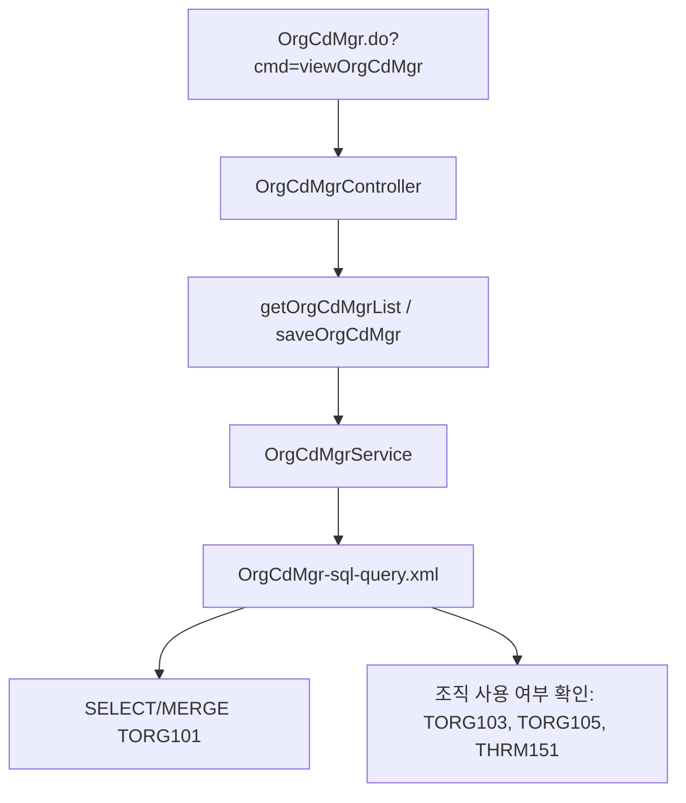
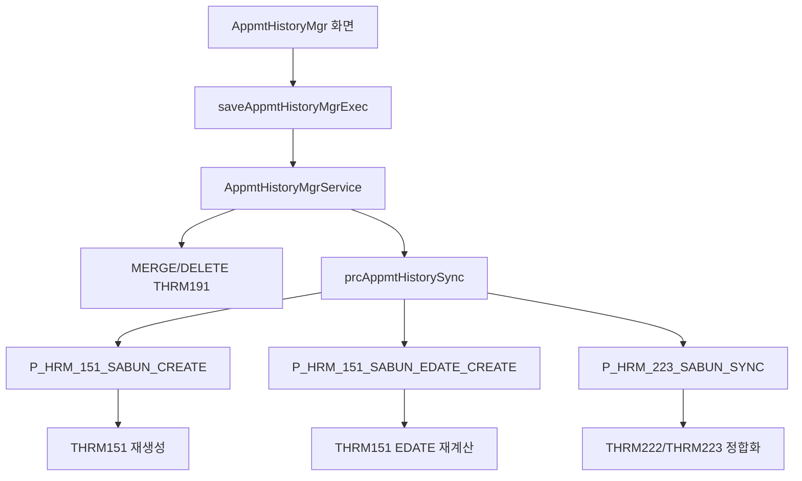
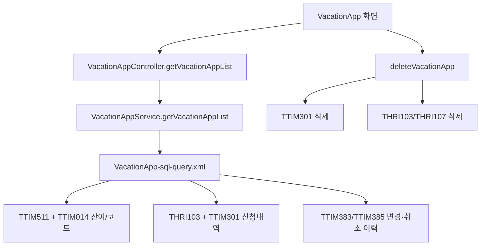
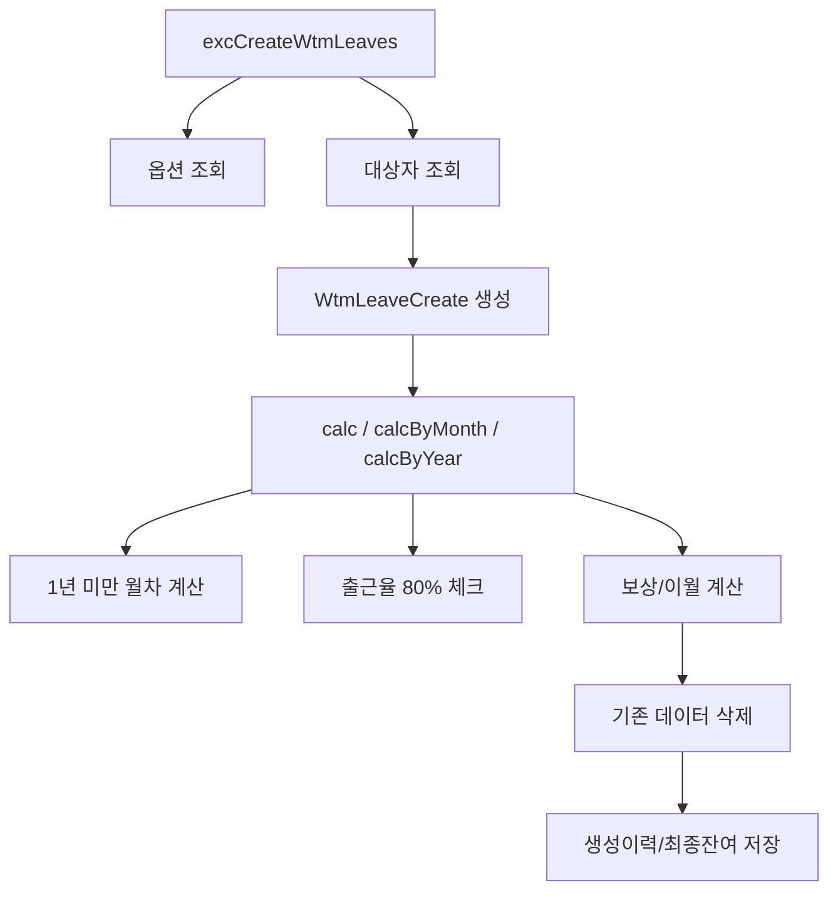
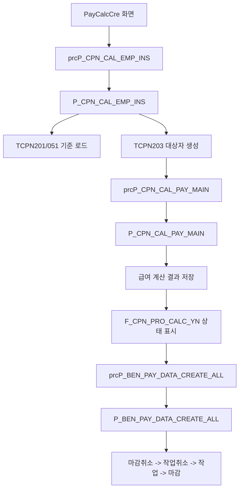
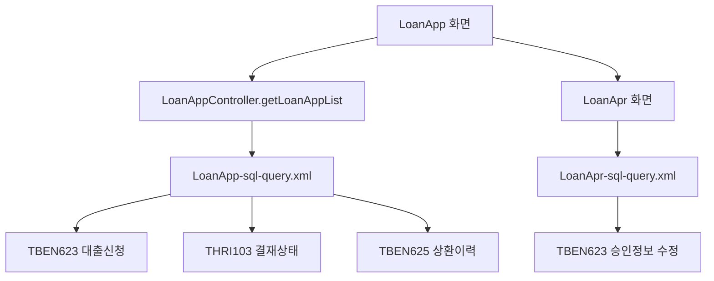
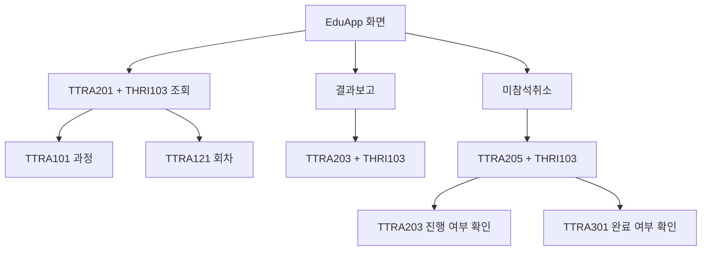
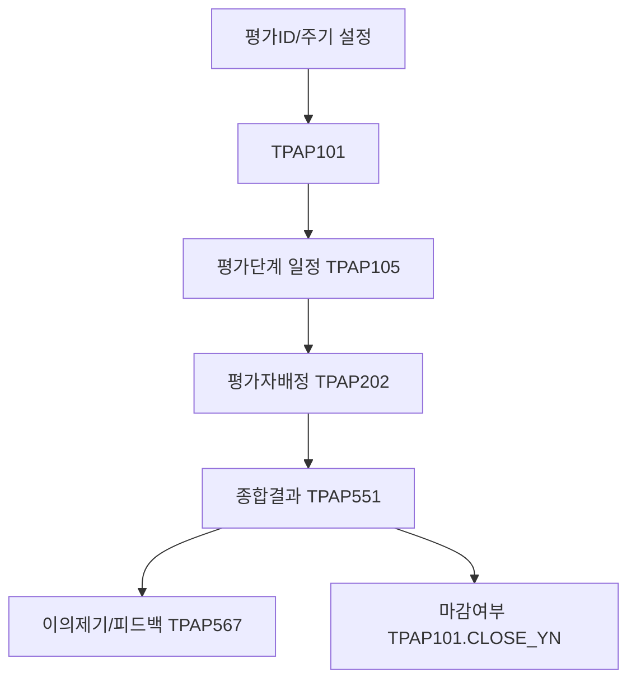

# EHR Legacy Business Flow Analysis

작성일: 2026-03-12  
분석 대상:
- 레거시 소스: `C:\EHR_PROJECT\isu-hr\EHR_HR50`
- DB 명세: `C:\Users\kms\Desktop\dev\EHR_6\EHR5_DB명세.sql`
- 비교 기준 저장소: `C:\Users\kms\Desktop\dev\vibe-hr`

## 1. 기능 개요

### 1.1 시스템 요약

이 저장소는 JSP + Spring MVC + MyBatis + Oracle 기반의 레거시 인사시스템이다.  
업무 흐름은 화면/Controller/Service에서 시작되지만, 실제 상태 전이와 계산의 상당 부분이 SQL, Oracle Function, Procedure에 분산되어 있다.

특히 아래 영역은 DB 의존도가 높다.

- 인사발령: `THRM191 -> THRM151/THRM223` 동기화
- 근태/연차: `TTIM*` + `TWTM*` + Java 계산 도메인 혼합
- 급여: `TCPN*` + `P_CPN_*` 프로시저 중심
- 복리후생: `TBEN*` + `P_BEN_*` + 급여연계
- 보안/권한: `F_SEC_*`, `P_SEC_*`, `TSYS3**`, `TSEC*`

### 1.2 기능 영역별 분류

| 영역 | 레거시 패키지/화면 근거 | 대표 DB 객체 | 구조적 특징 |
|---|---|---|---|
| 인사 | `src/main/java/com/hr/hrm/**`, `appmtHistoryMgr` | `THRM151`, `THRM191`, `THRM223`, `P_HRM_151_SABUN_CREATE`, `P_HRM_223_SABUN_SYNC` | 발령 이력 수정 후 DB 동기화 프로시저 필수 |
| 조직 | `src/main/java/com/hr/org/**`, `orgCdMgr` | `TORG101`, `TORG103`, `TORG105` | 코드/조직 구조 관리가 SQL 중심 |
| 근태 | `src/main/java/com/hr/tim/**`, `src/main/java/com/hr/wtm/**` | `TTIM014`, `TTIM301`, `TTIM383`, `TTIM385`, `TTIM511`, `TWTM*` | 신청/결재는 `THRI*`, 연차 생성은 Java 계산 도메인 비중 큼 |
| 급여 | `src/main/java/com/hr/cpn/**`, `payCalcCre` | `TCPN201`, `TCPN203`, `P_CPN_CAL_EMP_INS`, `P_CPN_CAL_PAY_MAIN`, `F_CPN_PRO_CALC_YN` | 프로시저 주도 계산 파이프라인 |
| 복리후생 | `src/main/java/com/hr/ben/**`, `loanApp`, `welfarePayDataMgr` | `TBEN623`, `TBEN625`, `TBEN991`, `TBEN993`, `P_BEN_PAY_DATA_CREATE_ALL` | 신청/승인 + 급여연계 + 사업별 마감 구조 |
| 교육 | `src/main/java/com/hr/tra/**`, `eduApp`, `eduApr`, `eduCancelApp`, `eduResultApr` | `TTRA101`, `TTRA121`, `TTRA201`, `TTRA203`, `TTRA205`, `TTRA301` | 교육신청, 미참석취소, 결과보고가 모두 결재 문서 기반 |
| 평가 | `src/main/java/com/hr/pap/**`, `appScheduleMgr`, `appResultMgr` | `TPAP101`, `TPAP105`, `TPAP202`, `TPAP551`, `TPAP567` | 평가주기, 평가자배정, 결과확정이 단계별 테이블로 분리 |
| 권한/공통코드 | `src/main/java/com/hr/common/**`, `CommonCodeController`, `SecurityMgrController` | `TSYS005`, `THRI101`, `TSEC007`, `F_SEC_GET_AUTH_CHK`, `P_SEC_SET_OBSERVER` | 공통코드/권한/URL토큰/접근감사 분리 |

### 1.3 핵심 엔트리 포인트

| 영역 | 화면/Controller | Service | Mapper/SQL | Procedure/Function |
|---|---|---|---|---|
| 조직 | `OrgCdMgrController` | `OrgCdMgrService` | `OrgCdMgr-sql-query.xml` | 미확인 |
| 인사발령 | `AppmtHistoryMgrController` | `AppmtHistoryMgrService` | `AppmtHistoryMgr-sql-query.xml` | `P_HRM_151_SABUN_CREATE`, `P_HRM_151_SABUN_EDATE_CREATE`, `P_HRM_223_SABUN_SYNC` |
| 근태신청 | `VacationAppController` | `VacationAppService` | `VacationApp-sql-query.xml` | 미확인 |
| 연차생성 | Controller 미확인 | `WtmLeaveCreMgrService.excCreateWtmLeaves` | `getWtmLeaveCre*` 쿼리 계열 | 미확인 |
| 급여계산 | `PayCalcCreController` | `PayCalcCreService`, `PayCalcCreProcService` | `PayCalcCre-sql-query.xml`, `PayCalcCreProc-sql-query.xml` | `P_CPN_CAL_EMP_INS`, `P_CPN_CAL_PAY_MAIN`, `P_BEN_PAY_DATA_CREATE_ALL`, `F_CPN_PRO_CALC_YN` |
| 복리후생신청 | `LoanAppController`, `LoanAprController` | `LoanAppService` | `LoanApp-sql-query.xml`, `LoanApr-sql-query.xml` | 미확인 |
| 복리후생급여연계 | `WelfarePayDataMgrController` | `WelfarePayDataMgrService` | `WelfarePayDataMgr-sql-query.xml` | `P_BEN_PAY_DATA_CREATE`, `P_BEN_PAY_DATA_CREATE_DEL`, `P_BEN_PAY_DATA_CLOSE`, `P_BEN_PAY_DATA_CLOSE_CANCEL` |
| 교육 | `EduAppController`, `EduAprController` 등 | `EduAppService` | `EduApp-sql-query.xml`, `EduApr-sql-query.xml`, `EduCancelApp-sql-query.xml`, `EduResultApr-sql-query.xml` | 미확인 |
| 평가 | Controller/Service 일부 미확인 | Service 일부 미확인 | `AppScheduleMgr-sql-query.xml`, `AppResultMgr-sql-query.xml` | `F_PAP_GET_APP_GROUP_NM2` 등 함수 사용 |
| 권한/공통코드 | `CommonCodeController`, `SecurityMgrController` | `CommonCodeService`, `SecurityMgrService` | `commonCode-sql-query.xml`, `SecurityMgr-sql-query.xml` | `F_COM_GET_LANGUAGE_TEXT`, `F_SEC_GET_AUTH_CHK`, `F_SEC_GET_TOKEN2`, `P_SEC_SET_OBSERVER` |

## 2. 주요 업무 시나리오

| 시나리오 ID | 영역 | 시작점 | 종료점 |
|---|---|---|---|
| S1 | 조직 | 조직코드관리 화면 조회/저장 | `TORG101` 갱신 및 사용중 조직 삭제 방지 |
| S2 | 인사발령 | 발령이력 수정/삭제 | `THRM191` 저장 후 `THRM151`, `THRM223`, `THRM222` 정합화 |
| S3 | 근태 | 휴가신청/취소/변경취소 | `TTIM301`, `TTIM383`, `TTIM385` + `THRI103`, `THRI107` 갱신 |
| S4 | 근태(WTM) | 연차생성 실행 | 옵션별 계산 후 연차 발생/이력/잔여일수 저장 |
| S5 | 급여 | 급여대상자 생성 -> 급여계산 -> 복리연계 | `TCPN203` 생성 후 `P_CPN_CAL_PAY_MAIN`, `P_BEN_PAY_DATA_CREATE_ALL` 실행 |
| S6 | 복리후생 | 대출신청 -> 승인 -> 상환조회 | `TBEN623`, `THRI103`, `TBEN625` 기준 업무 처리 |
| S7 | 교육 | 교육신청 -> 승인 -> 미참석취소/결과보고 | `TTRA201`, `TTRA205`, `TTRA203`, `THRI103` 기반 결재 흐름 |
| S8 | 평가 | 평가일정 설정 -> 평가자배정 -> 결과관리 | `TPAP105`, `TPAP202`, `TPAP551`, `TPAP567` 기반 확정 흐름 |

## 3. 시나리오별 업무 흐름 설명

### S1. 조직 코드 관리

근거:
- `src/main/java/com/hr/org/organization/orgCdMgr/OrgCdMgrController.java`
- `src/main/java/com/hr/org/organization/orgCdMgr/OrgCdMgrService.java`
- `src/main/resources/mapper/com/hr/org/organization/orgCdMgr/OrgCdMgr-sql-query.xml`

업무 흐름:
1. `/OrgCdMgr.do?cmd=viewOrgCdMgr`가 조직코드관리 화면을 연다.
2. `getOrgCdMgrList`가 `TORG101`을 조회한다.
3. 조회 시 `TORG103`, `TORG105` 사용 여부와 `THRM151` 조직 사용 이력을 함께 확인한다.
4. 저장 시 `MERGE INTO TORG101`로 조직코드를 갱신한다.
5. 삭제는 `TORG101` 대상이지만, 사용 중 여부는 조회 시점부터 SQL로 계산된다.

소스 로직과 DB 로직 역할 분리:
- Controller/Service: 요청 수집, 결과 반환
- SQL: 조직 사용중 여부 계산, 삭제 가능성 판단 보조, 코드 저장
- Procedure/Function: 확인된 직접 호출 없음

### S2. 인사 발령이력 수정과 조직사항 동기화

근거:
- `src/main/java/com/hr/hrm/appmt/appmtHistoryMgr/AppmtHistoryMgrController.java`
- `src/main/java/com/hr/hrm/appmt/appmtHistoryMgr/AppmtHistoryMgrService.java`
- `src/main/resources/mapper/com/hr/hrm/appmt/appmtHistoryMgr/AppmtHistoryMgr-sql-query.xml`
- DB 명세 `P_HRM_151_SABUN_CREATE`, `P_HRM_151_SABUN_EDATE_CREATE`, `P_HRM_223_SABUN_SYNC`

업무 흐름:
1. `/AppmtHistoryMgr.do?cmd=viewAppmtHistoryMgr`가 발령이력관리 화면을 연다.
2. `getAppmtHistoryMgrExecList`가 `THRM191` 발령이력을 조회한다.
3. `getAppmtHistoryMgrOrgList`가 `THRM151` 조직사항 이력을 조회한다.
4. `saveAppmtHistoryMgrExec`가 `THRM191`을 `MERGE` 또는 `DELETE` 한다.
5. 저장/삭제 후 서비스는 항상 `prcAppmtHistorySync`를 실행한다.
6. 동기화 프로시저는 `P_HRM_151_SABUN_CREATE`, `P_HRM_151_SABUN_EDATE_CREATE`, `P_HRM_223_SABUN_SYNC`를 호출한다.

소스 로직과 DB 로직 역할 분리:
- Controller/Service: 입력/삭제 요청과 프로시저 호출 오케스트레이션
- SQL Mapper: `THRM191` CRUD
- Procedure: 조직사항 재구성, 종료일 재계산, 발령처리 상세 동기화

### S3. 휴가 신청, 취소, 변경취소

근거:
- `src/main/java/com/hr/tim/request/vacationApp/VacationAppController.java`
- `src/main/java/com/hr/tim/request/vacationApp/VacationAppService.java`
- `src/main/resources/mapper/com/hr/tim/request/vacationApp/VacationApp-sql-query.xml`
- DB 명세 `TTIM014`, `TTIM301`, `TTIM383`, `TTIM385`, `TTIM511`, `THRI103`

업무 흐름:
1. `/VacationApp.do?cmd=viewVacationApp`가 휴가신청 화면을 연다.
2. 휴가 잔여/기준 정보는 `TTIM511`과 `TTIM014`를 함께 조회한다.
3. 신청 목록은 `THRI103` 결재상태와 `TTIM301` 휴가신청, `TTIM383/TTIM385` 변경/취소 이력을 조인한다.
4. 삭제 시 `VacationAppService.deleteVacationApp`는 `TTIM301`, `THRI103`, `THRI107`를 함께 삭제한다.
5. 변경취소 삭제 시 `deleteVacationAppUpd`는 `TTIM383`를 삭제한다.

소스 로직과 DB 로직 역할 분리:
- Controller/Service: 삭제 트랜잭션 순서 보장
- SQL: 목록 구성, 잔여휴가 계산용 데이터 조합
- Procedure: 확인된 직접 호출 없음

### S4. WTM 연차 생성 배치

근거:
- `src/main/java/com/hr/wtm/config/wtmLeaveCreMgr/WtmLeaveCreMgrService.java`
- `src/main/java/com/hr/wtm/config/wtmLeaveCreMgr/domain/WtmLeaveCreate.java`
- `src/main/java/com/hr/wtm/config/wtmLeaveCreMgr/domain/WtmAnnualLeaveA.java`
- `src/main/java/com/hr/wtm/config/wtmLeaveCreMgr/domain/WtmAnnualLeaveWithinOneYearA.java`
- `src/main/java/com/hr/wtm/config/wtmLeaveCreMgr/domain/WtmMonthlyLeaveWithinOneYearA.java`

업무 흐름:
1. `WtmLeaveCreMgrService.excCreateWtmLeaves(...)`가 연차생성의 실제 진입점이다.
2. 생성옵션을 읽어 연차 생성 기준을 결정한다.
3. 대상자 조건검색 SQL 결과를 읽어 대상 사원을 확정한다.
4. `WtmLeaveCreate` 객체를 만들고 `calc`, `calcByMonth`, `calcByYear` 중 하나를 호출한다.
5. 계속근로 1년 미만 월차, 출근율 80% 미만, 보상/이월 규칙을 추가 계산한다.
6. 기존 데이터 삭제 후 생성이력, 계산이력, 최종 잔여 데이터를 저장한다.

소스 로직과 DB 로직 역할 분리:
- Java 도메인 로직: 연차 계산식 자체
- SQL: 대상자/옵션/저장 대상 데이터 입출력
- Procedure: 확인된 직접 호출 없음

### S5. 급여대상자 생성, 급여계산, 복리후생 연계

근거:
- `src/main/java/com/hr/cpn/payCalculate/payCalcCre/PayCalcCreController.java`
- `src/main/java/com/hr/cpn/payCalculate/payCalcCre/PayCalcCreService.java`
- `src/main/java/com/hr/cpn/payCalculate/payCalcCre/PayCalcCreProcService.java`
- `src/main/resources/mapper/com/hr/cpn/payCalculate/payCalcCre/PayCalcCreProc-sql-query.xml`
- DB 명세 `P_CPN_CAL_EMP_INS`, `P_CPN_CAL_PAY_MAIN`, `P_BEN_PAY_DATA_CREATE_ALL`, `F_CPN_PRO_CALC_YN`

업무 흐름:
1. `/PayCalcCre.do?cmd=viewPayCalcCre`가 급여계산 화면을 연다.
2. `prcP_CPN_CAL_EMP_INS`가 `P_CPN_CAL_EMP_INS`를 호출해 급여대상자를 만든다.
3. 이 프로시저는 `TCPN201` 계산기준, `TCPN051` 급여유형/조건검색, `TCPN203` 대상자관리를 사용한다.
4. `prcP_CPN_CAL_PAY_MAIN` 또는 `prcP_CPN_BON_PAY_MAIN`이 계산 프로시저를 호출한다.
5. `P_CPN_CAL_PAY_MAIN`은 `TCPN203.PAY_PEOPLE_STATUS IN ('P','M','PM')`인 대상만 계산한다.
6. 급여 이벤트 표시는 `F_CPN_PRO_CALC_YN`이 `THRM100`, `THRM191`의 입사/퇴사/부서이동/보직이동을 월 단위로 판정한다.
7. 복리후생 연계는 `prcP_BEN_PAY_DATA_CREATE_ALL` -> `P_BEN_PAY_DATA_CREATE_ALL`로 실행된다.
8. 이 프로시저는 `TBEN991` 대상 건마다 마감취소 -> 작업취소 -> 작업 -> 마감 순서로 처리한다.

소스 로직과 DB 로직 역할 분리:
- Controller/Service: 프로시저 호출 버튼과 메시지 처리
- SQL Mapper: 인자 전달
- Procedure/Function: 대상자 선정, 계산, 상태판정, 복리연계

### S6. 복리후생 대출 신청, 승인, 상환

근거:
- `src/main/java/com/hr/ben/loan/loanApp/LoanAppController.java`
- `src/main/java/com/hr/ben/loan/loanApp/LoanAppService.java`
- `src/main/resources/mapper/com/hr/ben/loan/loanApp/LoanApp-sql-query.xml`
- `src/main/java/com/hr/ben/loan/loanApr/LoanAprController.java`
- `src/main/resources/mapper/com/hr/ben/loan/loanApr/LoanApr-sql-query.xml`
- DB 명세 `TBEN623`, `TBEN625`, `THRI103`

업무 흐름:
1. `/LoanApp.do?cmd=viewLoanApp`가 대출신청 화면을 연다.
2. 신청조회는 `TBEN623`와 `THRI103`를 조인해 결재상태와 대출확정 정보를 함께 보여준다.
3. 승인완료 상태(`THRI103.APPL_STATUS_CD='99'`)일 때만 `LOAN_YMD`, `LOAN_MON`, `REP_MON`가 노출된다.
4. 상환내역은 `TBEN625`를 조회한다.
5. 승인화면 `/LoanApr.do?cmd=viewLoanApr`는 `TBEN623 + THRI103` 기반 승인 대상을 조회한다.
6. 승인 저장은 `TBEN623`의 대출일, 상환월수, 이자율 등을 갱신한다.
7. 신청 삭제 시 `TBEN623` 삭제 후 결재 마스터/라인 삭제가 함께 일어난다.

소스 로직과 DB 로직 역할 분리:
- Controller/Service: 삭제/저장 트랜잭션
- SQL: 승인상태별 컬럼 노출, 사원정보 함수 조회, 상환완료 판단
- Procedure: 확인된 직접 호출 없음

### S7. 교육 신청, 승인, 미참석취소, 결과보고

근거:
- `src/main/java/com/hr/tra/requestApproval/eduApp/EduAppController.java`
- `src/main/java/com/hr/tra/requestApproval/eduApp/EduAppService.java`
- `src/main/resources/mapper/com/hr/tra/requestApproval/eduApp/EduApp-sql-query.xml`
- `src/main/resources/mapper/com/hr/tra/requestApproval/eduApr/EduApr-sql-query.xml`
- `src/main/resources/mapper/com/hr/tra/requestApproval/eduCancelApp/EduCancelApp-sql-query.xml`
- `src/main/resources/mapper/com/hr/tra/requestApproval/eduResultApr/EduResultApr-sql-query.xml`
- DB 명세 `TTRA101`, `TTRA121`, `TTRA201`, `TTRA203`, `TTRA205`, `TTRA301`, `THRI103`

업무 흐름:
1. 교육신청 화면은 `TTRA201` 신청과 `THRI103` 결재를 기본으로 조회한다.
2. 신청은 과정(`TTRA101`)과 회차(`TTRA121`)를 참조한다.
3. 결과보고는 `TTRA203 + THRI103`로 별도 문서를 만든다.
4. 교육취소는 `TTRA205 + THRI103`를 사용한다.
5. `EduCancelApp` 조회는 결과보고가 이미 진행 중이거나 교육완료(`TTRA301.EDU_CONFIRM_TYPE='1'`)면 취소를 막는다.
6. 신청 삭제는 `TTRA201`뿐 아니라 조건에 따라 `TTRA101`, `TTRA121`, `TTRA001`까지 정리한다.

소스 로직과 DB 로직 역할 분리:
- Controller/Service: 삭제 묶음 처리
- SQL: 신청/취소/결과보고 상태 판정, 참조 무결성 판단
- Procedure: 확인된 직접 호출 없음

### S8. 평가 일정 설정, 배정, 결과관리

근거:
- `src/main/resources/mapper/com/hr/pap/config/appScheduleMgr/AppScheduleMgr-sql-query.xml`
- `src/main/resources/mapper/com/hr/pap/progress/appResultMgr/AppResultMgr-sql-query.xml`
- DB 명세 `TPAP101`, `TPAP105`, `TPAP202`, `TPAP551`, `TPAP567`

업무 흐름:
1. 평가 마스터는 `TPAP101`에 저장된다.
2. 평가 단계별 일정은 `TPAP105`가 관리한다.
3. 상세 단계 순번 일정은 `TPAP104`가 관리된다.
4. 평가자/평가대상 배정은 `TPAP202`에서 관리된다.
5. 결과관리 화면은 `TPAP551` 종합결과를 기준으로 점수, 등급, 랭크를 조회한다.
6. 이의제기/피드백은 `TPAP567`에 저장된다.
7. 결과관리 화면은 `TPAP101.CLOSE_YN`을 별도 조회해 마감여부를 확인한다.

소스 로직과 DB 로직 역할 분리:
- Controller/Service: 화면별 CRUD
- SQL: 평가그룹명, 단계별 결과, 이의제기 여부, 마감여부 계산
- Function: `F_PAP_GET_APP_GROUP_NM2` 등 평가집계 함수 다수 사용

## 4. 호출 체인 표

| 시나리오 | 시작점 | Controller/API | Service | DAO/Mapper | SQL/Procedure/Function | Table |
|---|---|---|---|---|---|---|
| S1 조직 | `/OrgCdMgr.do?cmd=viewOrgCdMgr` | `OrgCdMgrController` | `OrgCdMgrService` | `OrgCdMgr-sql-query.xml` | `getOrgCdMgrList`, `saveOrgCdMgr` | `TORG101`, `TORG103`, `TORG105`, `THRM151` |
| S2 발령 | `/AppmtHistoryMgr.do?cmd=viewAppmtHistoryMgr` | `AppmtHistoryMgrController` | `AppmtHistoryMgrService` | `AppmtHistoryMgr-sql-query.xml` | `saveAppmtHistoryMgrExec`, `prcAppmtHistorySync`, `P_HRM_151_SABUN_CREATE`, `P_HRM_151_SABUN_EDATE_CREATE`, `P_HRM_223_SABUN_SYNC` | `THRM191`, `THRM151`, `THRM222`, `THRM223` |
| S3 휴가 | `/VacationApp.do?cmd=viewVacationApp` | `VacationAppController` | `VacationAppService` | `VacationApp-sql-query.xml` | `getVacationAppList`, `deleteVacationApp`, `deleteVacationAppUpd` | `TTIM014`, `TTIM301`, `TTIM383`, `TTIM385`, `TTIM511`, `THRI103`, `THRI107` |
| S4 연차생성 | 배치/서비스 호출 | Controller 미확인 | `WtmLeaveCreMgrService.excCreateWtmLeaves` | `getWtmLeaveCre*` 계열 쿼리 | `WtmLeaveCreate.calc*` | `TWTM*`, 옵션/이력/최종 저장 테이블 일부 미확인 |
| S5 급여 | `/PayCalcCre.do?cmd=viewPayCalcCre` | `PayCalcCreController` | `PayCalcCreService`, `PayCalcCreProcService` | `PayCalcCre-sql-query.xml`, `PayCalcCreProc-sql-query.xml` | `P_CPN_CAL_EMP_INS`, `P_CPN_CAL_PAY_MAIN`, `P_BEN_PAY_DATA_CREATE_ALL`, `F_CPN_PRO_CALC_YN` | `TCPN201`, `TCPN203`, `TCPN980`, `TCPN981`, `TSYS903`, `TSYS904` |
| S6 복리 | `/LoanApp.do`, `/LoanApr.do` | `LoanAppController`, `LoanAprController` | `LoanAppService` | `LoanApp-sql-query.xml`, `LoanApr-sql-query.xml` | `getLoanAppList`, `getLoanAprList`, `saveLoanApr` | `TBEN623`, `TBEN625`, `THRI103` |
| S6 복리연계 | `/WelfarePayDataMgr.do` | `WelfarePayDataMgrController` | `WelfarePayDataMgrService` | `WelfarePayDataMgr-sql-query.xml` | `P_BEN_PAY_DATA_CREATE`, `P_BEN_PAY_DATA_CREATE_DEL`, `P_BEN_PAY_DATA_CLOSE`, `P_BEN_PAY_DATA_CLOSE_CANCEL` | `TBEN991`, `TBEN993`, `TCPN980`, `TCPN201` |
| S7 교육 | `/EduApp.do`, `/EduApr.do` | `EduAppController` 등 | `EduAppService` | `EduApp-sql-query.xml`, `EduApr-sql-query.xml`, `EduCancelApp-sql-query.xml`, `EduResultApr-sql-query.xml` | `deleteEduApp1~4`, `deleteEduAppResult` | `TTRA101`, `TTRA121`, `TTRA201`, `TTRA203`, `TTRA205`, `TTRA301`, `THRI103` |
| S8 평가 | 평가설정/결과관리 화면 | Controller 미확인 | Service 미확인 | `AppScheduleMgr-sql-query.xml`, `AppResultMgr-sql-query.xml` | `saveAppScheduleMgr`, `saveAppResultMgr`, `getAppResultMgrMap`, `F_PAP_GET_APP_GROUP_NM2` | `TPAP101`, `TPAP104`, `TPAP105`, `TPAP202`, `TPAP551`, `TPAP567` |

## 5. 테이블 역할 정리

| 테이블 | 역할 | 근거 |
|---|---|---|
| `TORG101` | 조직코드 마스터 | `OrgCdMgr-sql-query.xml` |
| `TORG103`, `TORG105` | 조직체계/조직도 사용 여부 판정 | `OrgCdMgr-sql-query.xml` |
| `THRM191` | 발령이력 원본 | `AppmtHistoryMgr-sql-query.xml` |
| `THRM151` | 개인조직사항 이력 | DB 명세 `COMMENT ON TABLE THRM151` |
| `THRM222` | 발령처리세부내역 폐기이력 | `P_HRM_223_SABUN_SYNC` |
| `THRM223` | 발령처리세부내역 최종 | `P_HRM_223_SABUN_SYNC` |
| `THRI103` | 결재/신청 마스터 | DB 명세 `COMMENT ON TABLE THRI103` |
| `THRI107` | 결재라인/후속 결재 데이터 | `VacationAppService.deleteVacationApp` |
| `TTIM014` | 근태코드 마스터 | DB 명세 `TTIM014` |
| `TTIM301` | 휴가신청 | DB 명세 `TTIM301` |
| `TTIM383` | 휴가 변경/정정 요청 이력 | `VacationApp-sql-query.xml` |
| `TTIM385` | 휴가 취소 요청 이력 | `VacationApp-sql-query.xml`, DB 명세 |
| `TTIM511` | 연차/휴가 잔여 관리 | DB 명세 `TTIM511` |
| `TCPN201` | 급여계산 기준/기간/지급일 관리 | DB 명세 `COMMENT ON TABLE TCPN201` |
| `TCPN203` | 급여대상자관리 | DB 명세 `COMMENT ON TABLE TCPN203` |
| `TCPN980` | 급여구분별 복리연계 기준 | `WelfarePayDataMgr-sql-query.xml`, DB 명세 |
| `TBEN623` | 대출신청 | DB 명세 `TBEN623` |
| `TBEN625` | 대출상환 이력 | DB 명세 `TBEN625` |
| `TBEN991` | 복리후생 급여연계 마감상태 | DB 명세 `TBEN991` |
| `TBEN993` | 복리후생 담당자 관리 | DB 명세 `TBEN993` |
| `TTRA101` | 교육과정 | DB 명세 `TTRA101` |
| `TTRA121` | 교육회차/이벤트 | DB 명세 `TTRA121` |
| `TTRA201` | 교육신청 | DB 명세 `COMMENT ON TABLE TTRA201` |
| `TTRA203` | 교육결과보고 | DB 명세 `TTRA203` |
| `TTRA205` | 교육취소/미참석 요청 | DB 명세 `TTRA205` |
| `TTRA301` | 교육이수/확정 결과 | DB 명세 `TTRA301` |
| `TPAP101` | 평가마스터 | DB 명세 `TPAP101` |
| `TPAP105` | 평가단계 일정 | DB 명세 `TPAP105` |
| `TPAP202` | 평가자-대상자 배정 | DB 명세 `TPAP202` |
| `TPAP551` | 평가종합결과 | `AppResultMgr-sql-query.xml`, DB 명세 |
| `TPAP567` | 피드백/이의제기 | `AppResultMgr-sql-query.xml`, DB 명세 |
| `TSYS005` | 공통코드 마스터 | `commonCode-sql-query.xml` |
| `TSEC007` | 로그인 세션/토큰/중복로그인 | `SecurityMgr-sql-query.xml` |
| `TSEC009` | RSA 개인키 저장 | `SecurityMgr-sql-query.xml` |

## 6. DB 로직에 존재하는 핵심 업무 규칙

| 업무규칙ID | 규칙 내용 | 위치 | 근거 |
|---|---|---|---|
| BR-01 | 발령이력 저장 후 `THRM151`을 최신 `THRM191` 기준으로 재생성한다. | `P_HRM_151_SABUN_CREATE` | DB 명세 프로시저 본문에 `DELETE FROM THRM151` 후 `INSERT INTO THRM151 ... FROM THRM191` |
| BR-02 | `THRM151.EDATE`는 다음 시작일 - 1일, 다음 이력이 없으면 `99991231`로 채운다. | `P_HRM_151_SABUN_EDATE_CREATE` | DB 명세 `MIN(SDATE)-1`, 기본값 `99991231` |
| BR-03 | 발령이력 수정/삭제 시 `THRM223` 최종상세와 `THRM222` 폐기이력을 함께 동기화한다. | `P_HRM_223_SABUN_SYNC` | DB 명세 프로시저 설명과 `INSERT INTO THRM222` |
| BR-04 | 급여대상자 생성은 `TCPN201` 계산기준과 `TCPN051.SEARCH_SEQ` 조건검색 규칙을 먼저 읽는다. | `P_CPN_CAL_EMP_INS` | DB 명세 프로시저 본문 `F_CPN_GET_201_INFO`, `TCPN051` 조회 |
| BR-05 | 급여계산은 `TCPN203.PAY_PEOPLE_STATUS IN ('P','M','PM')`인 대상만 처리한다. | `P_CPN_CAL_PAY_MAIN` | DB 명세 `CURSOR CSR_EMP` |
| BR-06 | 복리후생 급여연계 일괄작업은 마감취소 -> 작업취소 -> 작업 -> 마감 순서로 처리한다. | `P_BEN_PAY_DATA_CREATE_ALL` | DB 명세 프로시저 본문 호출 순서 |
| BR-07 | 대출신청 승인완료(`APPL_STATUS_CD='99'`) 전에는 확정 대출일/상환월 정보를 노출하지 않는다. | `LoanApp-sql-query.xml` | `DECODE(B.APPL_STATUS_CD, '99', ...)` |
| BR-08 | 휴가신청 삭제 시 `TTIM301`뿐 아니라 `THRI103`, `THRI107`도 함께 삭제한다. | `VacationAppService.deleteVacationApp` | 서비스 메서드와 mapper delete ID |
| BR-09 | 교육취소 요청은 결과보고가 진행 중이거나 교육완료 상태면 허용하지 않는다. | `EduCancelApp-sql-query.xml` | `NOT EXISTS (TTRA203 + THRI103)`, `NOT EXISTS (TTRA301 EDU_CONFIRM_TYPE='1')` |
| BR-10 | 교육신청 삭제 시 외부교육 참조가 남아 있으면 과정(`TTRA101`), 회차(`TTRA121`), 기관(`TTRA001`)을 삭제하지 않는다. | `EduApp-sql-query.xml` | `NOT EXISTS` 조건이 있는 `deleteEduApp2~4` |
| BR-11 | 평가 결과관리 화면은 마감여부를 `TPAP101.CLOSE_YN`에서 별도로 읽는다. | `AppResultMgr-sql-query.xml` | `getAppResultMgrMap` |
| BR-12 | 공통코드는 기준일 범위 내 유효값만 조회하며 언어변환 함수가 우선 적용된다. | `commonCode-sql-query.xml` | `F_COM_GET_LANGUAGE_TEXT`, `baseSYmd/baseEYmd` 조건 |
| BR-13 | 보안 권한 판정은 `F_SEC_GET_AUTH_CHK`로 일괄 처리한다. | `SecurityMgr-sql-query.xml` | `PrcCall_F_SEC_GET_AUTH_CHK` |
| BR-14 | 무단 접근/파라미터 변조는 `P_SEC_SET_OBSERVER`로 감사 로그를 남긴 뒤 세션을 끊는다. | `SecurityMgrController`, `SecurityMgr-sql-query.xml` | `SecurityError`와 `PrcCall_P_SEC_SET_OBSERVER` |
| BR-15 | 연차 생성은 생성옵션에 따라 기준연도/입사월/입사일 계산식이 달라지고, 출근율 80% 미만/보상/이월 규칙을 추가 적용한다. | `WtmLeaveCreMgrService.excCreateWtmLeaves` | 서비스 주석과 `calc`, `calcByMonth`, `calcByYear` 분기 |

## 7. 소스에서 보이지 않고 DB에 숨어있는 로직

1. 발령이력 수정만으로는 업무가 끝나지 않는다. `THRM191` 저장 뒤 `P_HRM_151_SABUN_CREATE`, `P_HRM_151_SABUN_EDATE_CREATE`, `P_HRM_223_SABUN_SYNC`가 추가로 돌아야 조직사항과 발령처리 상세가 정합해진다.
2. 급여 화면은 프로시저 호출 UI에 가깝다. 실제 대상자 선정, 계산, 재계산, 오류기록, 상태전이는 `P_CPN_*`, `F_CPN_*`에 숨어 있다.
3. 복리후생 급여연계는 화면 저장이 아니라 `TBEN991` 마감상태와 `P_BEN_PAY_DATA_*` 조합으로 동작한다.
4. 근태 신청은 `TTIM301`만 보면 부족하다. 결재 상태는 `THRI103`, 변경/취소는 `TTIM383`, `TTIM385`, 잔여일수는 `TTIM511`, 코드정책은 `TTIM014`까지 봐야 한다.
5. 교육 취소 가능 여부는 Java가 아니라 SQL 서브쿼리로 판정된다. 결과보고 진행 여부와 교육완료 여부를 동시에 막는다.
6. 평가 결과관리 화면은 `TPAP551` 단일 테이블이 아니라 `TPAP202`, `TPAP567`, 평가 함수들, `TPAP101.CLOSE_YN`을 함께 읽는다.
7. 보안은 Controller에서 직접 판단하지 않고 `F_SEC_GET_AUTH_CHK`, `F_SEC_GET_TOKEN2`, `P_SEC_SET_OBSERVER`로 DB에서 권한판정과 감사로그를 수행한다.

## 8. 비즈니스 로직 위치 구분

| 영역 | Java/Service 비중 | SQL/Procedure 비중 | 판단 |
|---|---|---|---|
| 조직 | 낮음 | 높음 | SQL 중심 |
| 인사발령 | 중간 | 매우 높음 | Procedure 중심 |
| 근태 신청 | 중간 | 중간 | 결재/이력 SQL 중심 |
| WTM 연차생성 | 매우 높음 | 중간 | Java 계산 도메인 중심 |
| 급여 | 낮음 | 매우 높음 | Procedure/Function 중심 |
| 복리후생 신청 | 중간 | 중간 | 신청은 SQL, 급여연계는 Procedure |
| 교육 | 중간 | 중간 | SQL 상태판정 + 결재문서 조합 |
| 평가 | 낮음 | 높음 | SQL/Function 중심 |
| 권한/공통코드 | 낮음 | 매우 높음 | DB 함수 중심 |

## 9. React + PostgreSQL 전환 시 영향도가 큰 지점

1. `P_CPN_CAL_EMP_INS`, `P_CPN_CAL_PAY_MAIN`, `F_CPN_PRO_CALC_YN`
2. `P_HRM_151_SABUN_CREATE`, `P_HRM_151_SABUN_EDATE_CREATE`, `P_HRM_223_SABUN_SYNC`
3. `WtmLeaveCreMgrService`와 `domain/Wtm*Leave*.java`
4. `THRI103`, `THRI107` 기반 공통 결재 흐름
5. `F_SEC_GET_AUTH_CHK`, `F_SEC_GET_TOKEN2`, `P_SEC_SET_OBSERVER`
6. `TPAP551` + `TPAP202` + `TPAP567` + `F_PAP_GET_APP_GROUP_NM2`

## 10. 불명확한 부분 및 추가 확인 필요 항목

| 항목 | 상태 |
|---|---|
| `WtmLeaveCreMgrController` 실제 화면/배치 진입 URL | 미확인 |
| 급여 상세 프로시저 내부가 최종적으로 어떤 결과 테이블을 추가 갱신하는지 전체 목록 | 미확인 |
| 평가 영역 Controller/Service 클래스별 정확한 메서드 이름 | 일부 미확인 |
| `THRI107` 상세 스키마와 결재라인 처리 전체 규칙 | 일부 미확인 |
| `P_BEN_PAY_DATA_CREATE`, `P_BEN_PAY_DATA_CLOSE` 내부 세부 로직 | 이름/호출관계만 확인, 본문 미확인 |
| `TTRA001` 기관 삭제 규칙이 다른 교육 모듈에도 동일하게 적용되는지 | 미확인 |

## 11. 우선순위 제안

1. 급여(`CPN`)와 발령(`HRM`)은 DB 의존도가 가장 높으므로 현대화 설계 시 최우선 분석 대상이다.
2. 근태는 일반 `TIM`과 `WTM`이 분리되어 있어, 휴가신청 흐름과 연차생성 흐름을 별도 서비스로 나눠 설계해야 한다.
3. 복리후생은 신청/승인보다 급여연계(`TBEN991`, `P_BEN_PAY_DATA_CREATE_ALL`)를 먼저 해체해야 전체 파이프라인이 보인다.
4. 교육과 평가는 CRUD보다 상태전이와 결재 흐름이 중요하므로, 화면 단위 이식보다 프로세스 단위 재설계가 적합하다.
